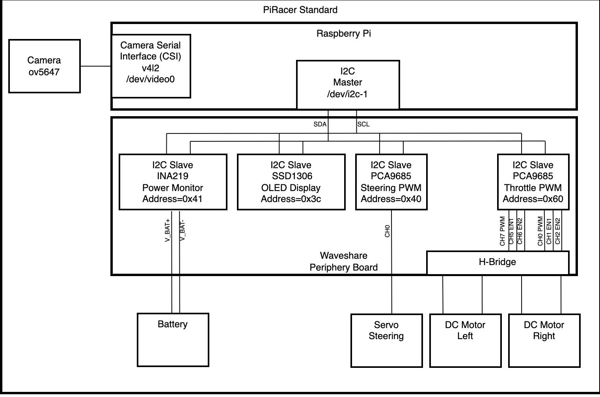
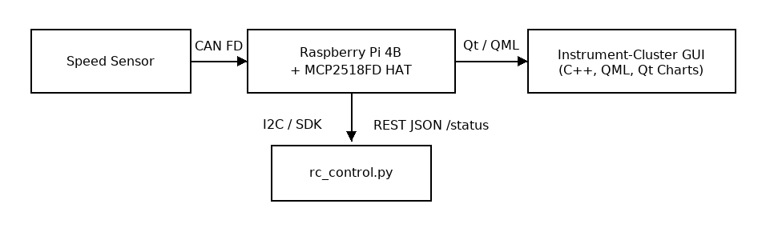

# [DES] Instrument Cluster - Team 5

## 1. Project Summary
The [DES] Instrument Cluster is a Qt‑based application that runs on a Raspberry Pi and visualises real‑time vehicle data coming from a speed sensor over the Controller Area Network (CAN) bus.  It also provides a Python‑based remote‑control module that exposes battery voltage and gear state via a REST‑style JSON API.

This project was completed as part of the SEA‑ME program and showcases hands‑on skills in embedded C++/QML, CAN communication, multithreaded Python, and hardware‑software integration. 

- Speed Sensor Data Collection: Gathers vehicle speed data using an Arduino CAN shield.
- Data Transmission and Communication: Transmits data to Raspberry Pi through the CAN bus and CAN HAT.
- Qt Application: Receives and visualizes the collected data in real-time on a dashboard.
- I2C Communication (Bonus Feature): Gathers vehicle battery data via I2C and displays it on the Qt app.

[More information](https://github.com/SEA-ME/DES_Instrument-Cluster)

## 2. Features
|Category|Highlights|
|:-------:|:--------:|
|Qt GUI| • Smooth speedometer gauge up to 150 cm/s  <br>• Battery‑level and gear indicators <br> • Full‑screen 400×1280 portrait layout|
|CAN Interface|• Decodes speed data from an MCP2518FD CAN HAT <br>• Robust socket‑CAN abstraction|
|Python Control|• Xbox-360 gamepad <br>• Battery voltage & gear monitoring<br>• Flask JSON endpoint `/status` |

## 3. System Architecture
 
 

## 4. Repository Layout
```text
SEA-ME_Instrument-Cluster/
├── Arduino #Sending speed data via CAN
└──  GUI/
    ├── Instrument_Cluster/         #Qt 6 source code for desktop
    ├── Instrument_Cluster_raspi/   #Qt 6 source code for embedded system
        ├── Main.qml     
        ├── main.cpp
        ├── SpeedNeedle.qml
        ├── BatterNeedle.qml
        ├── Gear.qml
        └── timeprovider.cpp/.h
    └── volt_gear.py                #Python remote control
```
[Browse the full project](https://github.com/oyg0323/SEA-ME_Instrument-Cluster/tree/main/GUI)

## 5. Hardware Requirements
|  HW    | Image    |
|:--------:|:--------:|
| PiRacer     |     |
| Arduino UNO  |   |
| CAN-BUS Shield V2.0  |      |
| CAN-BUS (FD) HAT for Raspberry Pi    |      |
| Raspberri Pi 4    |      |
| Speed Sensor     |     |
| 7.9 inch Display     |     |
| Joystick(controller)     |     |

## 6. Build & Installation
### 6.1 Prpare Raspberry Pi OS
```text
dmesg | grep -i spi             # check can hat   
 
sudo ip link set can1 up type can bitrate 500000 #ready to communicate can1  

source ~/env_tf1/bin/activate   # active  
```
### 6.2 Build & Play Qt Appliaction
```text
sudo apt install qt6-base-dev qt6-multimedia-dev qml6-module-qtcharts

git clone https://github.com/oyg0323/SEA-ME_Instrument-Cluster.git
cd SEA-ME_Instrument-Cluster/GUI/Instrument_Cluster_raspi

rm -rf build

mkdir build && cd build

cmake .. -DCMAKE_BUILD_TYPE=Release

make -j$(nproc)

export DISPLAY=:0

./Practice
```

### 6.3 Python Control Service
```text
pip3 install piracer flask evdev

# Edit the IP address in volt_gear.py if needed, then:
python3 volt_gear.py
```

## 7. Usage Tips
|  Action    | Gamepad Control    |
|:--------:|:--------:|
|Accelerate(Gear D)|A held|
|Reverse(Gear R)|B held|
|Steering|Left stick(X-axis)|

The gear state (D, R, N) is calculated automatically based on the current throttle direction.

## 8. Result


[Video](https://github.com/oyg0323/SEA-ME_Instrument-Cluster/blob/main/images/Result_rotated.mp4)


## 9. Contributors
|Gihoon Kim|Youngyo Oh|Pritish Chowdhury|
|:--:|:--:|:--:|
|[](https://github.com/JoeyGihoon)|[](https://github.com/oyg0323)|[](https://github.com/XZIBIT93)|