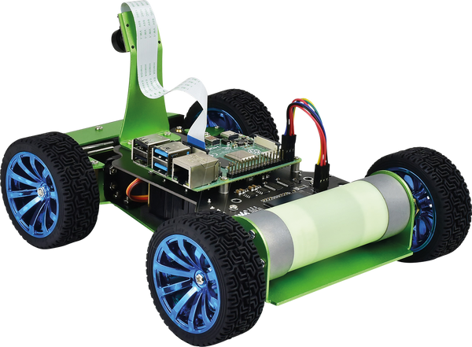
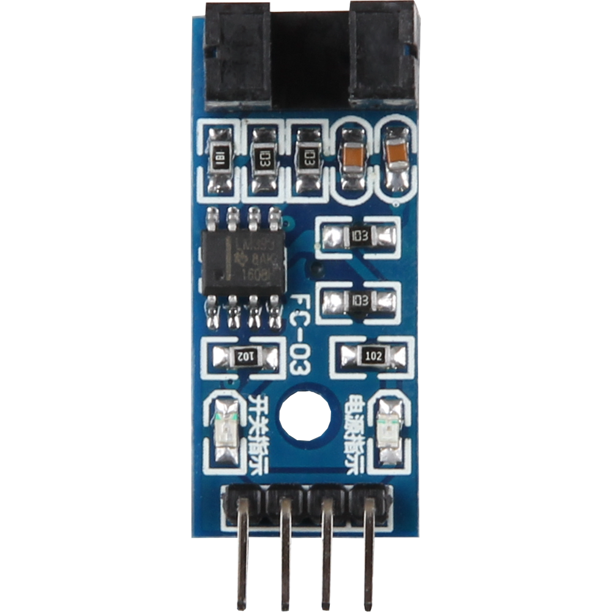
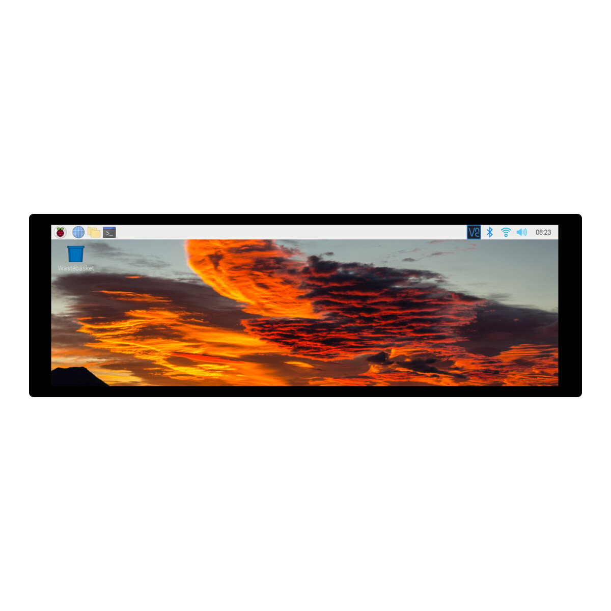
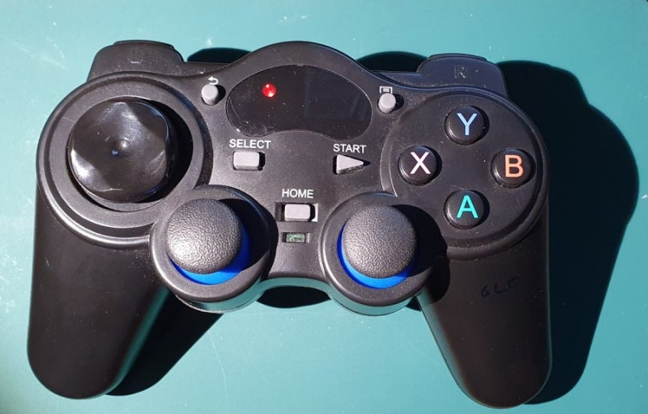

# [DES] Instrument Cluster - Team 5
||||
|:--:|:--:|:--:|

## Introduction
This project implements a Qt-based instrument cluster for the PiRacer, displaying live speed readings on a Raspberry Pi. By tapping into the vehicle’s CAN bus, the application retrieves data directly from the speed sensor and renders it in real time. Throughout development, we focused on designing a modular software architecture suitable for embedded environments, integrating Qt’s GUI components to create an intuitive display. Leveraging CAN communication protocols and Raspberry Pi hardware, this work showcases a complete end-to-end solution—from low-level data acquisition to polished user interface. The finished application demonstrates our ability to architect and build an automotive-grade display system and to document and present the results clearly.  

## HW Components
|  HW    | Image    |
|:--------:|:--------:|
| PiRacer     |     |
| Arduino UNO  |   |
| CAN-BUS Shield V2.0  |      |
| CAN-BUS (FD) HAT for Raspberry Pi    |      |
| Raspberri Pi 4    |      |
| Speed Sensor     |     |
| 7.9 inch Display     |     |
| Joystick(controller)     |     |

- Speed Sensor Data Collection: Gathers vehicle speed data using an Arduino CAN shield.
- Data Transmission and Communication: Transmits data to Raspberry Pi through the CAN bus and CAN HAT.
- Qt Application: Receives and visualizes the collected data in real-time on a dashboard.
- I2C Communication (Bonus Feature): Gathers vehicle battery data via I2C and displays it on the Qt app.

## Installation and Usage
### Installation

### Usage

